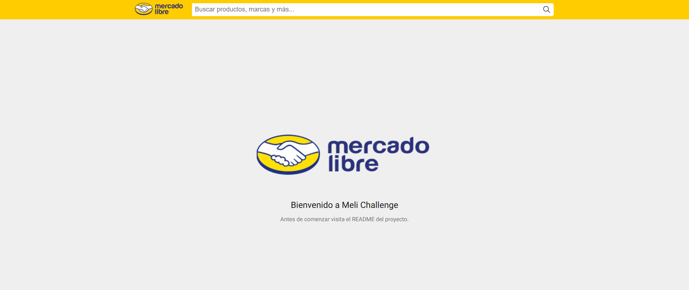
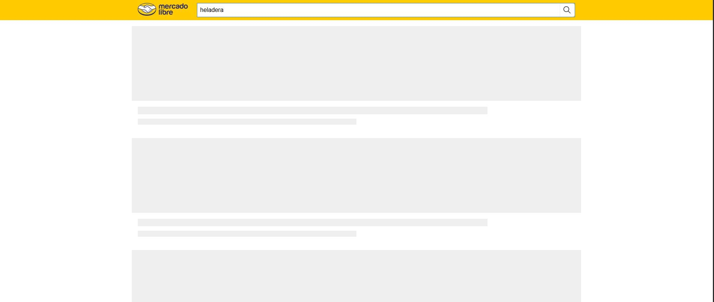
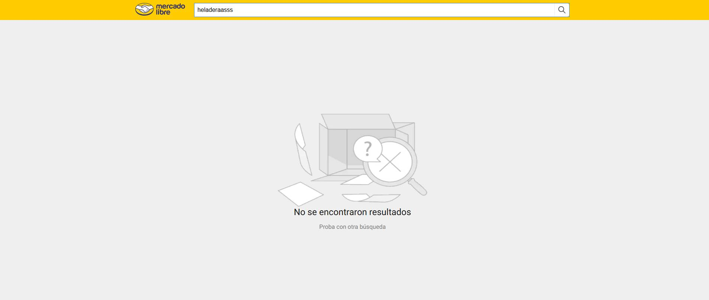
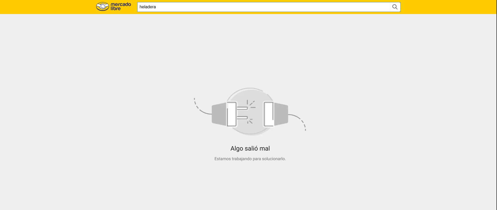
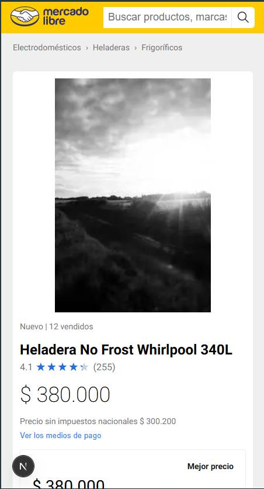
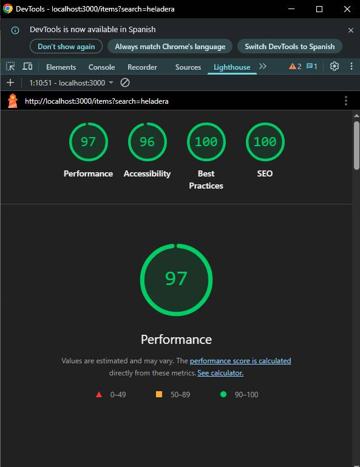

# Meli Prueba Técnica

Proyecto Frontend para el challenge técnico de Mercado Libre. Incluye frontend en Next.js (React 19), backend en Node.js/Express y pruebas automáticas.

> 👀 **Nota:** Los archivos mock de datos fueron modificados parcialmente para que la aplicación fuera más funcional y amigable con el usuario.

## Tabla de contenidos

- [Meli Prueba Técnica](#meli-prueba-técnica)
  - [Instrucciones](#instrucciones)
  - [Stack Tecnológico](#stack-tecnológico)
  - [Estructura del Proyecto](#estructura-del-proyecto)
  - [Características y Usabilidad](#características-y-usabilidad)
  - [Capturas de pantalla](#capturas-de-pantalla)  
  - [Escalabilidad](#escalabilidad)
  - [Performance](#performance)
  - [SEO](#seo)
  - [Testing](#testing)


## Instrucciones

1. Clona el repositorio y entra a la carpeta del proyecto.
2. Ejecuta `npm install` para instalar todas las dependencias (frontend y backend).
3. Inicia backend con:
  ```bash
  npm run server
  ```
3. Inicia frontend con:
  ```bash
  npm run dev
  ```
  
  Esto levanta:
  - **Frontend**: Next.js en [http://localhost:3000](http://localhost:3000)
  - **Backend**: Node.js/Express en [http://localhost:3001](http://localhost:3001)

### Otros scripts útiles
- `npm run cypress:open`: tests E2E
- `npm run test`: tests unitarios


## Stack Tecnológico

**Frontend:**
- Next.js 15 (React 19)
- TypeScript
- Sass (SCSS modules)
- Zustand (state management)


**Backend:**
- Node.js
- Express
- Mock de datos (JSON)


**Testing:**
- Jest, Testing Library (unitarios)
- Cypress (E2E)


## Estructura del Proyecto

```
├── src/
│   ├── app/           # Páginas Next.js y vistas
│   ├── api/           # Lógica de consumo de API
│   ├── ux-ui/         # Componentes UI reutilizables
│   ├── store/         # Zustand store
│   └── assets/        # Estilos globales
├── server/            # Backend Express y mocks
├── public/            # Imágenes y assets estáticos
├── __tests__/         # Pruebas unitarias
```


## Características y Usabilidad

- **Búsqueda de productos** con autogestión de estado y navegación.
- **Mensajes personalizados** para errores, sin resultados y bienvenida.
- **Skeleton loaders** durante la carga de datos.
- **Mobile first**: diseño adaptable y responsivo.
- **Breadcrumbs** de categorías.
- **Detalle de producto** con información, imagen y vendedor.

## Capturas de pantalla

A continuación se muestran screenshots de partes clave de la prueba:

### Pantalla de bienvenida

*Mensaje de bienvenida al ingresar a la app.*

### Estado de carga (Skeleton Loader)

*Indicador visual mientras se cargan los productos.*

### Sin resultados de búsqueda

*Mensaje personalizado cuando no se encuentran productos.*

### Error en la búsqueda

*Mensaje de error cuando ocurre un problema en la búsqueda.*

### Input de búsqueda con focus

*El input de búsqueda muestra el estado de focus cuando está vacío o se requiere atención.*

### Vista mobile

*La aplicación es responsive y se adapta a dispositivos móviles.*


## Escalabilidad

- Arquitectura modular: separación clara entre frontend, backend, servicios y componentes.
- Fácil de extender: agregar nuevas rutas, vistas o servicios es sencillo.


## Performance

- Data fetching eficiente y sin caché para SSR (Next.js fetch con `no-store`).
- Manejo de errores robusto en frontend y backend.


## SEO

- Metadatos dinámicos con Next.js (`generateMetadata`).
- Títulos y descripciones personalizadas por página/búsqueda.


*Resultados de SEO proporcionado por google*

## Testing

- Pruebas unitarias con Jest y Testing Library (`npm run test`).
- Pruebas E2E con Cypress (`npm run cypress:open`).
- Mocks de datos y servicios para tests confiables.

---

Desarrollado por Emanuel85 para el challenge de Mercado Libre.
